# Tutorial

## Set Background
- Turn off prespective zoom.

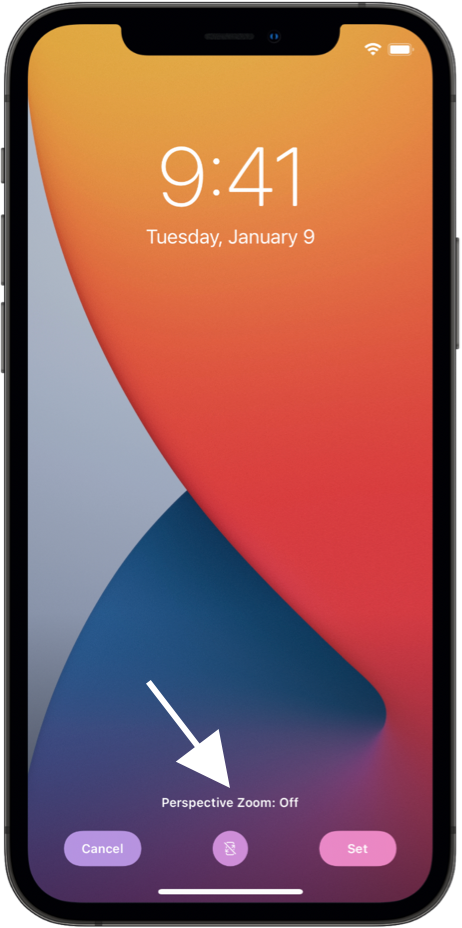

- From the Home Screen, touch and hold a widget or an empty area until the apps jiggle. 

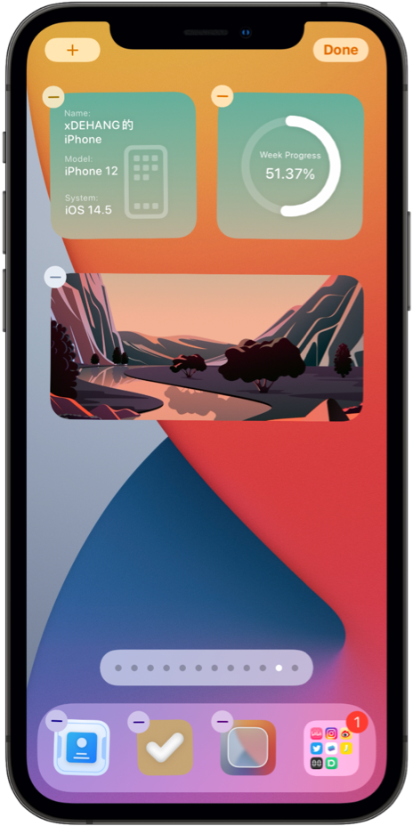

- Keep swiping right till you reach ablank page.

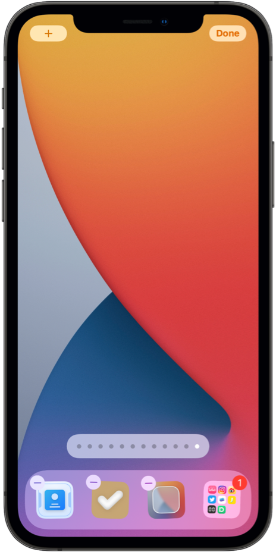

- Take screenshots in dark and light mode.

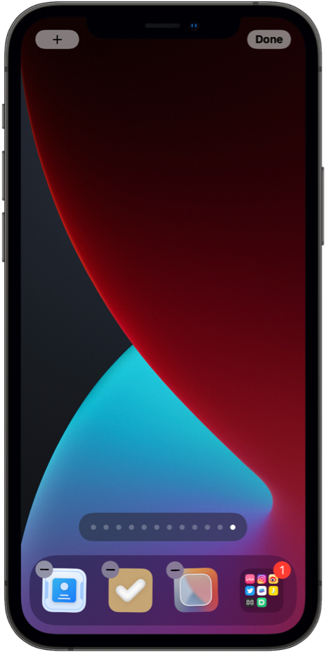

- Enter the main app and upload the screenshots.

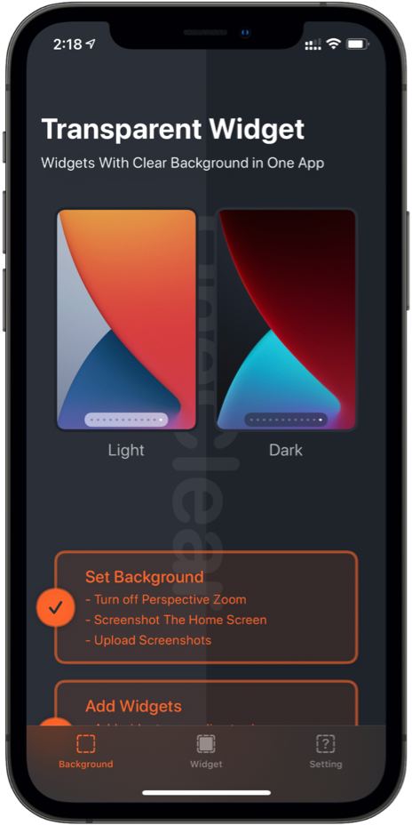

## Add Widget

- Add widgets according to size.

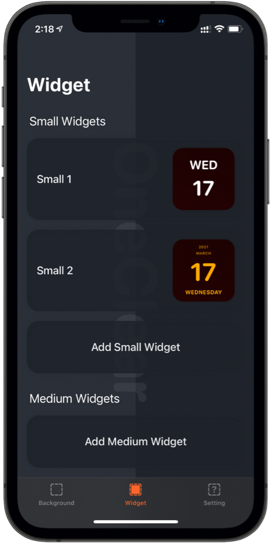

- Choose whichever style you like.

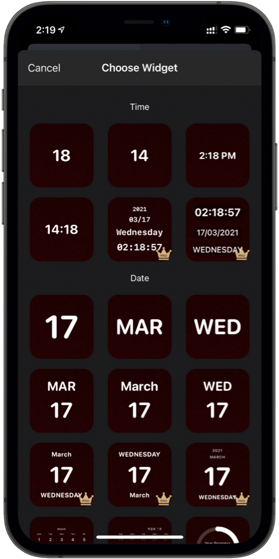

- Customize the name and style.

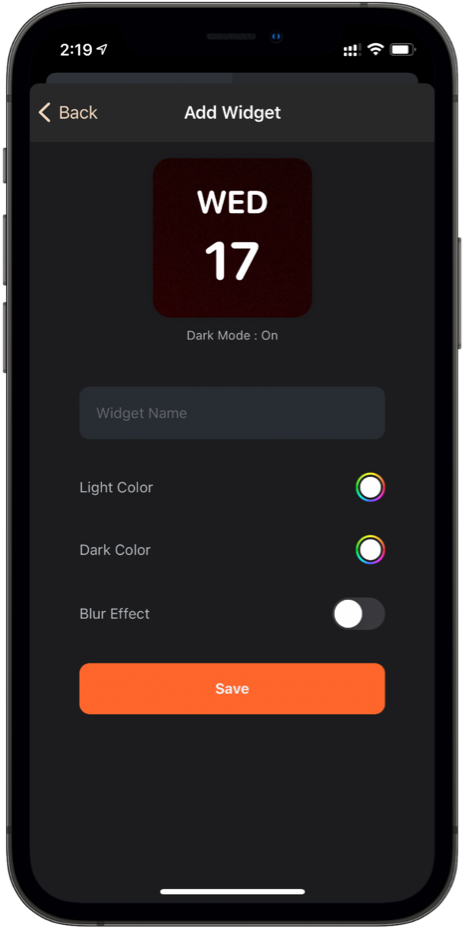

- Back to HomeScreen and enter Jiggle Mode. Select the app widget, choose from three widget sizes, then tap Add Widget.

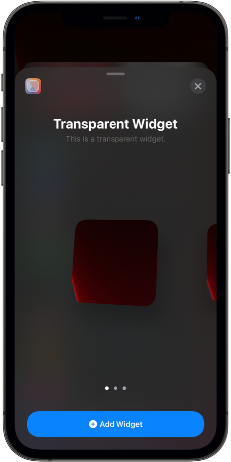

- Tap Eidt Widget and select exactly widget position.

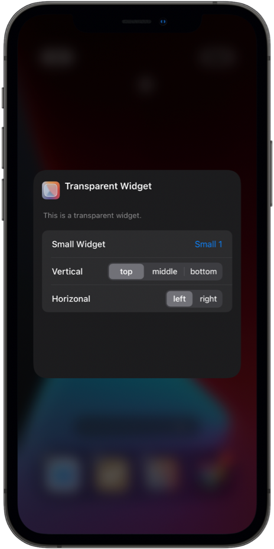

## Preview

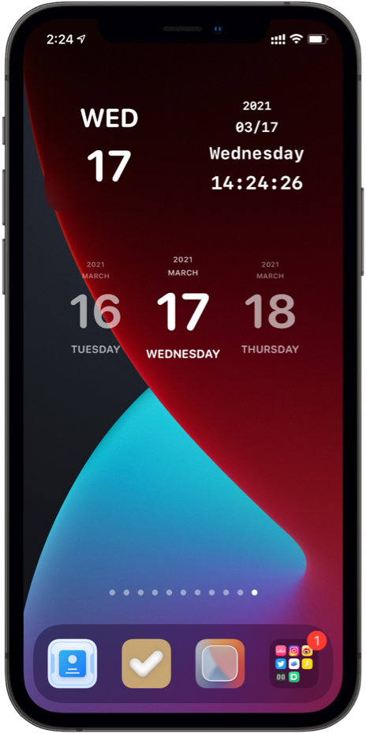

If you have any question or comment about Transparent Widget, you can contact us:

Email: hi@onexkit.com

Twitter:@onexdavis

Weibo:陈大好Davis